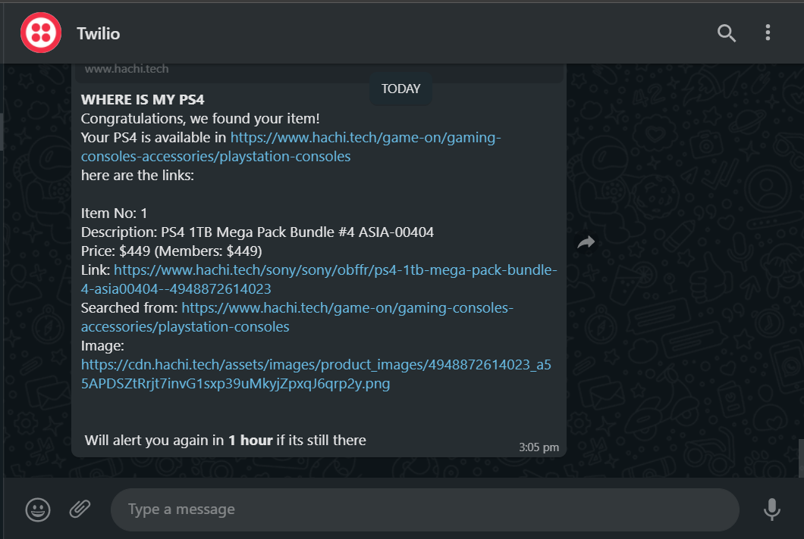

# Seriously-where-is-my-PS5
Where is my PS5?! Is a Cron bot that searches and scans Singapore Challenger's Hachi Tech for any Stock of PS5(Or any other search item of your liking). It can print and send whenever it has found a stock to the user, attached with link to the purchase. Pages are scanned every 1 second

## Let me know when there's a PS5 via Whatsapp
Example is given for ps4 ( You can also change the search field)

### Specifications of alerts
1. List of products found in that page that matches the `search_word`
2. For each product:
   1. Description
   2. Link
   3. Price(s)
   4. Search Page
   5. Image

### Bot Intervals
1.Searches the page every 1 second
2. Pauses for 1 hour when a search is found, messaging the user.

# Whatsapp Setup
## Setting up environment variables for Twilio (Whatsapp)
Please ensure that the following secrets are setup for Twilio in your environment
For your machine/container/rc

    TWILIO_ACCOUNT_SID = os.environ.get("TWILIO_ACCOUNT_SID")
    TWILIO_AUTH_TOKEN = os.environ.get("TWILIO_AUTH_TOKEN")
    TWILIO_WHATSAPP_FROM = os.environ.get("TWILIO_FROM")
    TWILIO_WHATSAPP_TO = os.environ.get("TWILIO_TO")`

### Sending to multiple whatsapp numbers
TWILIO_TO accepts a comma separated list
   
   example: of 2 numbers

   `os.environ['TWILIO_TO] = "123456,1234123"`

## If you're using Twilio Sandbox
1. This is a free feature from Twilio to get free whatsapp messaging
2. Users need to rejoin their sandbox channels
3. We remind users every 70/72 hours to rejoin by replying to twilio

You can setup the reminder message here:

    sandbox_rejoin_message = "join turquoise-dolphin"

# Parameters
Edit the main.py script, it was designed to have everything in a single file/function

So that we can put this into a lightweight cronjob/container.

I have a miniPC that pulls/downloads just the file and runs it.

### Modifying the project to search other products:
Change these values in main.py

What to search for:

    SEARCH_ITEM = "PS5"

Where to search it from:

    HACHI_SEARCH_PAGE_LINK = (
        "https://www.hachi.tech/game-on/gaming-consoles-accessories/playstation-consoles"
    )

# Setting up the project

We assume you have Python installed

1. Git clone the project
2. Run the project by:

      python main.py

3. No other dependencies/requirements.txt required.
4. This was designed with pure Python in mind without bs4/scrapy so that I can run it in my crap-machine 24/7

## Project setup suggestions
1. You can have the python script running constantly 24/7 in your own laptop as you work,
2. Or you may setup a container yourself in GCP/AWS/Azure that constantly runs this in terminal

# Preview

Whatsapp Alert Messaging
I set it to search for Ps4 in this Image

Console Logs while its searching

## Comments

#### "Why your code is so ugly and has no test"

I wrote it in 3 hours on a Saturday morning, I have a full time job and family and I just need something to get the job done.

It was intended that everything fits into a single main.py function because I have a crap 1ghz machine that pulls this script along other cron scripts to do my bidding.
This runs 24/7

#### "Can it support X/Y/Z"

Listen, open source is where I put out my own creations for my own use, but I just happen to share it to the public out of my own free time and kindness.

You are free to make a request, but I have no obligation to work for you, unless you are my paymaster.

If your requests looks like something that will benefit >me< as well, then I will give it a shot and add it in.

PRs are welcome.

